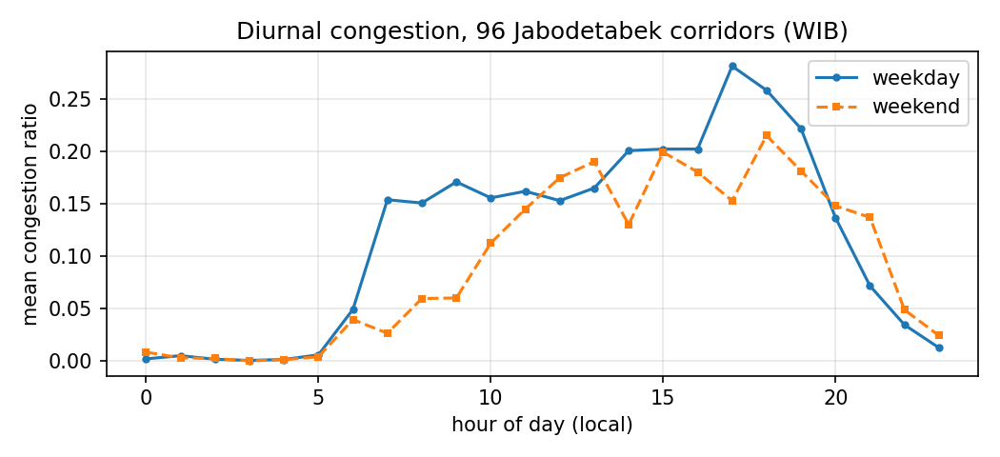
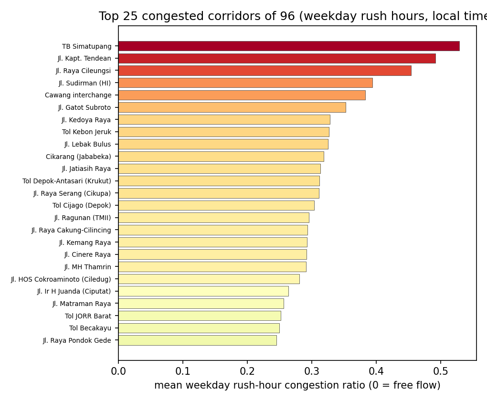
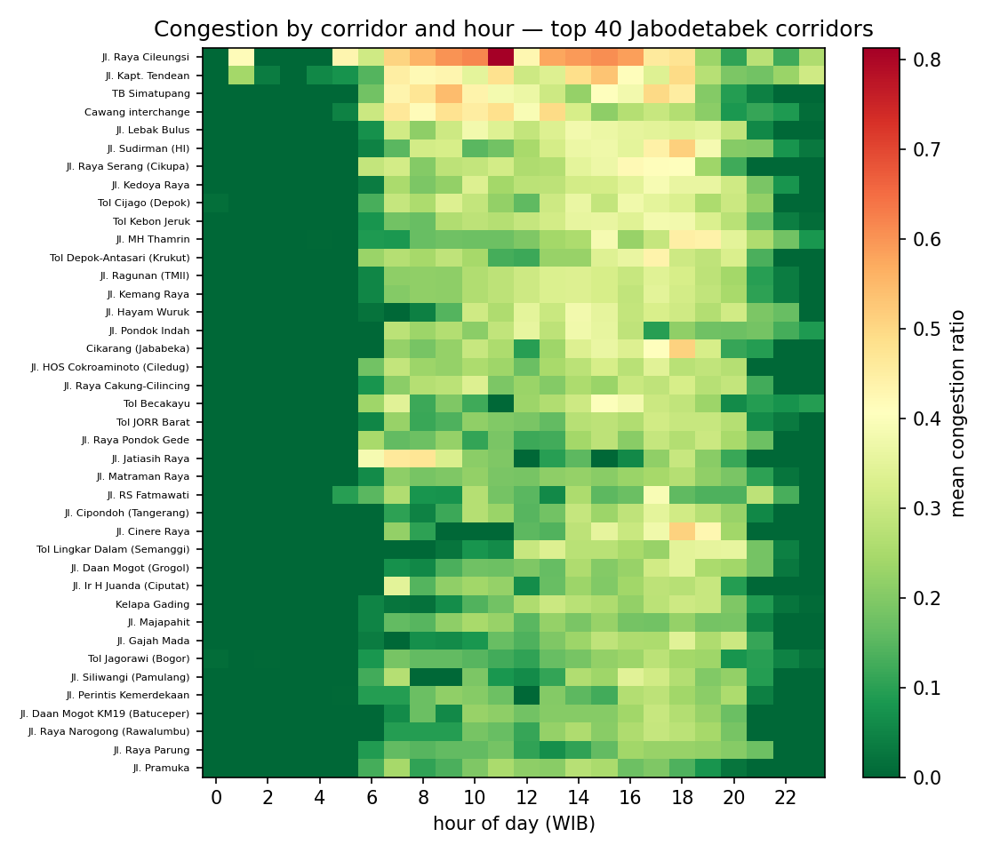
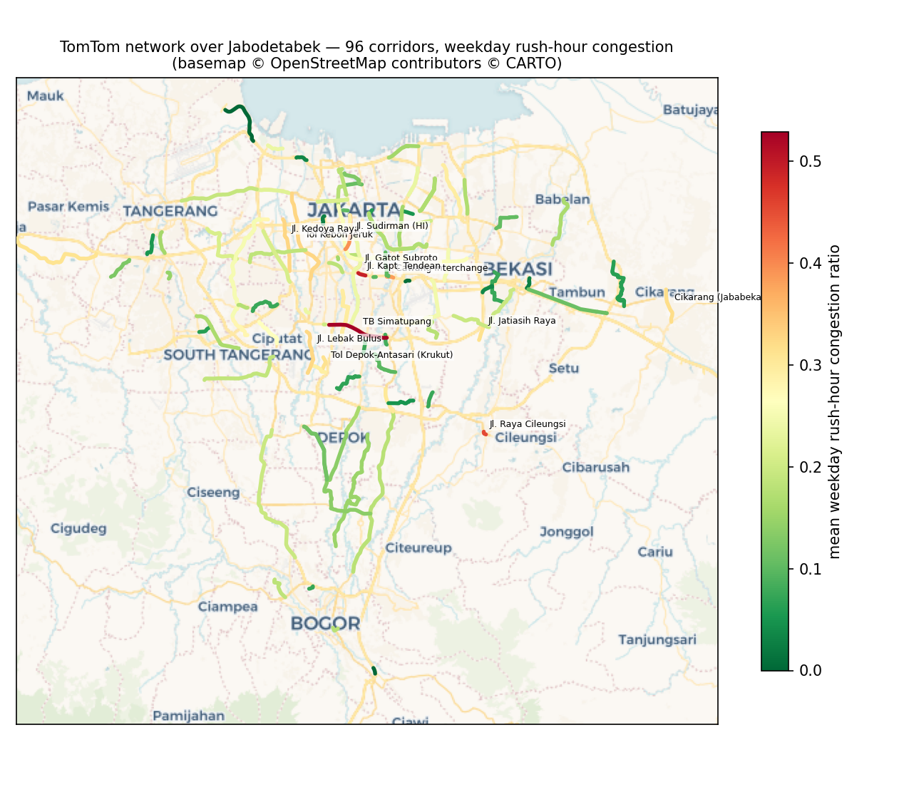

# TomTom Traffic Data — Exploratory Data Analysis (Jabodetabek)

*Auto-generated by `generate_eda.py` from `sample_data/tomtom_sample.csv`
(14,008 hourly observations, 96 Jabodetabek
corridors, 2026-07-23 → 2026-08-21,
27 days). Hours shown in WIB (UTC+7).*

## 1. What one observation looks like

Each hourly poll of one corridor yields one row (see
`sample_data/sample_flow_response.json` for the raw API response):

| station_id | obs_time_utc | current_speed | free_flow_speed | congestion_ratio | confidence |
|---|---|---|---|---|---|
| tt_sudirman_s | 2026-08-21 13:00:00+00:00 | 16.00 | 21.00 | 0.24 | 1.00 |
| tt_merdekabar | 2026-08-21 13:00:00+00:00 | 16.00 | 26.00 | 0.38 | 0.92 |
| tt_yossudarso | 2026-08-21 13:00:00+00:00 | 33.00 | 42.00 | 0.21 | 1.00 |

`congestion_ratio = 1 − current_speed / free_flow_speed` — 0 means free flow,
0.5 means traffic at half the free-flow speed.

## 2. Corridor overview (top 15 by mean congestion)

| name | rows | mean_speed | free_flow | mean_congestion | max_congestion |
|---|---|---|---|---|---|
| Jl. Raya Cileungsi | 50 | 17.94 | 28.90 | 0.38 | 0.88 |
| Jl. Kapt. Tendean | 138 | 27.74 | 38.67 | 0.28 | 0.83 |
| TB Simatupang | 392 | 55.39 | 71.79 | 0.23 | 0.91 |
| Cawang interchange | 392 | 33.02 | 42.60 | 0.23 | 0.79 |
| Jl. Lebak Bulus | 138 | 25.11 | 31.42 | 0.20 | 0.53 |
| Jl. Sudirman (HI) | 392 | 30.61 | 38.37 | 0.20 | 0.74 |
| Jl. Raya Serang (Cikupa) | 50 | 30.30 | 37.90 | 0.20 | 0.47 |
| Tol Cijago (Depok) | 50 | 30.68 | 38.24 | 0.20 | 0.45 |
| Jl. Kedoya Raya | 138 | 23.11 | 28.67 | 0.19 | 0.50 |
| Tol Kebon Jeruk | 392 | 28.46 | 35.30 | 0.19 | 0.49 |
| Tol Depok-Antasari (Krukut) | 50 | 21.70 | 26.50 | 0.18 | 0.52 |
| Cikarang (Jababeka) | 50 | 22.18 | 27.16 | 0.18 | 0.54 |
| Jl. MH Thamrin | 392 | 18.39 | 22.57 | 0.18 | 0.77 |
| Jl. Ragunan (TMII) | 138 | 22.95 | 27.95 | 0.18 | 0.45 |
| Jl. Kemang Raya | 138 | 22.96 | 27.95 | 0.18 | 0.45 |

## 3. Diurnal pattern

Jakarta's twin rush hours are clearly visible, and weekends flatten the
morning peak far more than the evening one:

## 4. Corridor ranking (weekday rush hours)

Top 10 of 96:

| name | rush_congestion | mean_speed | free_flow |
|---|---|---|---|
| TB Simatupang | 0.53 | 33.77 | 71.65 |
| Jl. Kapt. Tendean | 0.49 | 19.63 | 38.52 |
| Jl. Raya Cileungsi | 0.45 | 15.79 | 29.00 |
| Jl. Sudirman (HI) | 0.39 | 23.38 | 38.61 |
| Cawang interchange | 0.38 | 26.27 | 42.51 |
| Jl. Gatot Subroto | 0.35 | 28.83 | 44.26 |
| Jl. Kedoya Raya | 0.33 | 19.19 | 28.59 |
| Tol Kebon Jeruk | 0.33 | 23.90 | 35.51 |
| Jl. Lebak Bulus | 0.33 | 21.00 | 31.11 |
| Cikarang (Jababeka) | 0.32 | 18.57 | 27.29 |

## 5. Corridor × hour heatmap

## 6. Road network on the map

Corridor polylines (returned by the API itself) drawn over a real basemap,
colored by weekday rush-hour congestion:

## Notes & caveats

- TomTom flow data is **real-time only** — no historical API exists on the
  free tier, so a time-series must be built by polling on a schedule.
- `confidence` < 1 means fewer probe vehicles; treat low-confidence rows with
  care.
- Corridors were added in stages (14 → 64), so early dates cover fewer
  corridors; per-corridor row counts differ. Full per-corridor history:
  `full_data/<station_id>.csv`.
- This sample covers ~3 weeks; seasonal effects (rainy season, Ramadan,
  school holidays) need longer collection.
- Basemap tiles: © OpenStreetMap contributors © CARTO. Traffic data:
  © TomTom — check the [TomTom developer terms](https://developer.tomtom.com/terms-and-conditions)
  before redistributing collected data.
